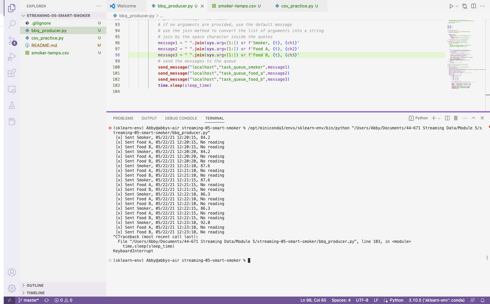
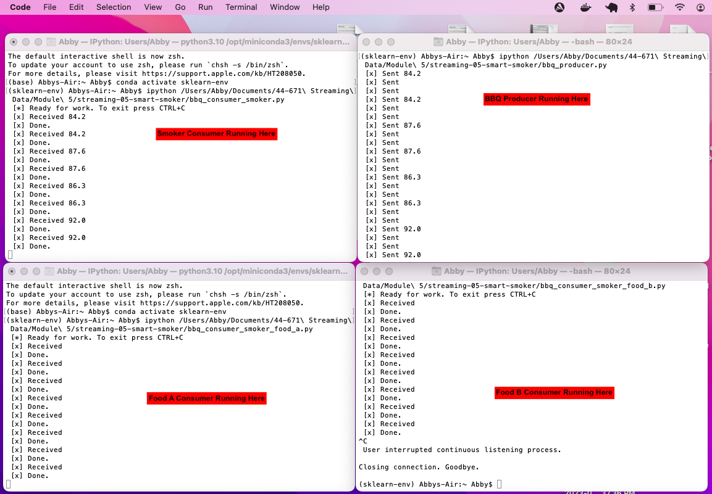
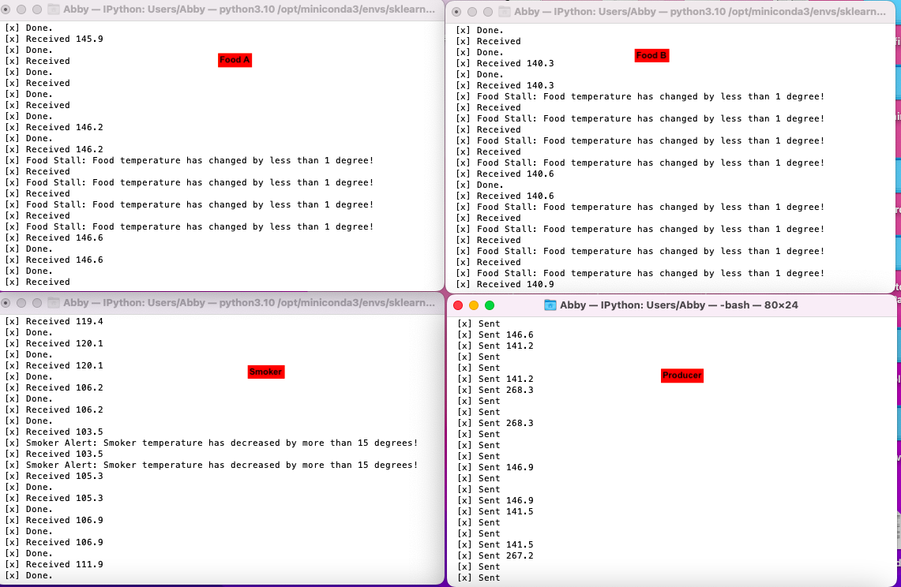
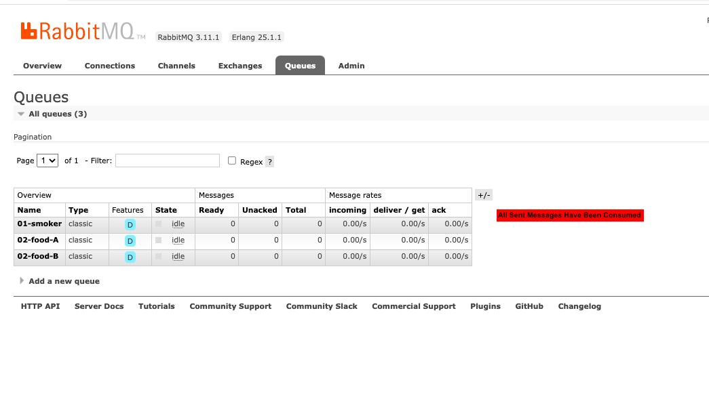

# streaming-05-smart-smoker
## Abby Lloyd
## 11 Feb 2023

> Create a producer to stream information from a smart smoker. Create three consumers to read information and send an alert message if certain criteria are met.  

## Challenge to Solve
We want to stream information from a smart smoker. Read one value every half minute. (sleep_secs = 30)

smoker-temps.csv has 4 columns:

[0] Time = Date-time stamp for the sensor reading
[1] Channel1 = Smoker Temp --> send to message queue "01-smoker"
[2] Channel2 = Food A Temp --> send to message queue "02-food-A"
[3] Channel3 = Food B Temp --> send to message queue "02-food-B"

## Requirements
- RabbitMQ server running
- pika installed in your active environment

## RabbitMQ Admin
- See http://localhost:15672/Links to an external site.

## General Design Questions
- How many producers processes do you need to read the temperatures: 1
- How many queues do we use: 3
- How many listening callback functions do we need (Hint: one per queue): 3

## Preliminary Results of Producer Running - Terminal
- A an example of the producer running in the terminal

## Next Steps: We want know if...
- The smoker temperature decreases by more than 15 degrees F in 2.5 minutes (smoker alert!)
- Any food temperature changes less than 1 degree F in 10 minutes (food stall!)

## Deque Max Length
- At one reading every 1/2 minute, the smoker deque max length is 5 (2.5 min * 1 reading/0.5 min
- At one reading every 1/2 minute, the food deque max length is 20 (10 min * 1 reading/0.5 min) 

## Results of Producer and Three Consumers Running Simultaneously

## Consumers Showing Alert Messages

## Results of RabbitMQ After Messages Have Been Sent And Consumed

